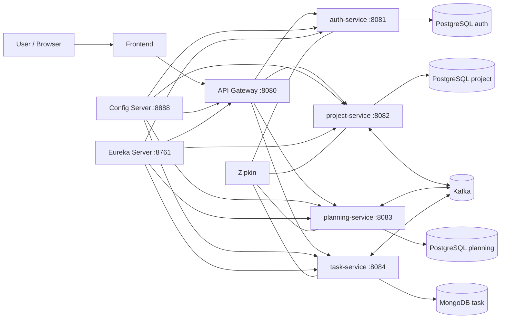

# Jirops Current Project Architecture

This document is a factual snapshot of the repository as it exists now. It is intended to be used as source material for prompt-building, documentation, or presentation generation.

## 1. Project Summary

Jirops is a Jira-like project management platform implemented as a Java Spring Boot microservices system with a separate React frontend.

The system is organized as a monorepo with:

- A Spring Boot backend split into infrastructure services and business services
- A React + Vite frontend
- Docker Compose for local orchestration
- Centralized configuration and service discovery
- Event-driven communication through Kafka
- Database-per-service persistence

## 2. Repository Structure

### Backend modules

- `jwt-commons` - shared JWT and security helpers
- `config-server` - centralized configuration service
- `eureka-server` - service discovery
- `api-gateway` - public entry point and JWT gatekeeper
- `auth-service` - registration, login, token refresh, logout
- `project-service` - project CRUD and team member management
- `planning-service` - sprint lifecycle and planning operations
- `task-service` - task CRUD, comments, attachments, search, and status updates

### Frontend

- `frontend` - React single-page application built with Vite and Tailwind CSS

### Supporting files

- `docker-compose.yml` - local infrastructure and service orchestration
- `pom.xml` - Maven parent for the backend microservices
- `.github/workflows/ci.yaml` - CI pipeline for backend tests and container image builds

## 3. High-Level Architecture

## 4. Technology Stack

### Backend

- Java 17
- Spring Boot 3.2.4
- Spring Cloud 2023.0.1
- Spring Cloud Gateway
- Spring Cloud Config Server
- Netflix Eureka
- Spring Security
- Spring Data JPA
- Spring Data MongoDB
- Spring for Apache Kafka
- JJWT 0.12.5 for token generation and validation
- Lombok
- Flyway for relational database migrations
- Testcontainers for integration testing support
- Jacoco for test coverage reporting

### Frontend

- React 18.3.1
- Vite 6.1.0
- Tailwind CSS 3.4.17
- PostCSS
- Autoprefixer
- lucide-react for icons
- fast-glob as a supporting dependency

### Infrastructure

- Docker and Docker Compose
- PostgreSQL 15
- MongoDB 7
- Kafka 7.6.0
- Zookeeper 7.6.0
- Zipkin for distributed tracing

## 5. Backend Architecture

The backend follows a microservices architecture with clear separation of concerns:

- `api-gateway` is the only public entry point
- `config-server` centralizes runtime configuration
- `eureka-server` handles service registration and discovery
- `jwt-commons` contains shared security primitives used by multiple services
- Each business service owns its own domain logic and persistence

### Shared configuration model

Each backend service uses a `bootstrap.yml` file to import configuration from the config server:

- `spring.config.import: configserver:http://config-server:8888`
- `spring.cloud.config.uri: http://config-server:8888`
- `fail-fast: true`

The config server uses the native profile and reads configuration files from:

- `config-server/src/main/resources/config/*.yml`

### Service ports

- API Gateway: `8080`
- Auth Service: `8081`
- Project Service: `8082`
- Planning Service: `8083`
- Task Service: `8084`
- Config Server: `8888`
- Eureka Server: `8761`

## 6. Request and Security Flow

### Gateway behavior

The gateway is the public ingress point and routes requests by path:

- `/auth/**` -> `auth-service`
- `/projects/**` -> `project-service`
- `/sprints/**` -> `planning-service`
- `/tasks/**` -> `task-service`

The gateway uses a `JwtGlobalFilter` that:

- Bypasses auth routes
- Requires a Bearer token for all other routes
- Validates the token
- Accepts only access tokens, not refresh tokens
- Extracts the user ID and roles from the token
- Forwards them to downstream services as:
  - `X-User-Id`
  - `X-Roles`

### Shared JWT library

`jwt-commons` provides reusable JWT and security support:

- `JwtTokenProvider`
- `JwtAuthenticationFilter`
- `GatewayHeaderAuthenticationFilter`
- `AuthenticatedUser`
- `SecurityBeans`

This lets the gateway validate and forward identity, and lets downstream services convert forwarded identity headers into an authenticated principal.

### Auth service endpoints

The auth service exposes:

- `POST /auth/register`
- `POST /auth/login`
- `POST /auth/refresh`
- `POST /auth/logout`

It uses PostgreSQL to store users and refresh tokens.

### Downstream service security

The business services rely on:

- forwarded gateway headers
- Spring Security
- method-level authorization patterns
- security test controllers for identity verification

## 7. Service Responsibilities

### Auth Service

Responsibility:

- User registration and login
- Token issuance and refresh
- Logout flows
- Secure identity lifecycle management

Data store:

- PostgreSQL

Notable code areas:

- `AuthController`
- `AuthService`
- `User`
- `RefreshToken`
- `SecurityConfig`
- `ObservabilityConfig`

### Project Service

Responsibility:

- Project creation, update, deletion, and lookup
- Project member management
- Publishing project lifecycle events

Data store:

- PostgreSQL

Kafka events:

- `project.created`
- `project.deleted`

Notable code areas:

- `ProjectController`
- `ProjectService`
- `ProjectRepository`
- `ProjectEventPublisher`
- `KafkaProducerConfig`

### Planning Service

Responsibility:

- Sprint creation and lifecycle management
- Sprint-to-task assignment
- Reacting to task status changes

Data store:

- PostgreSQL

Kafka events:

- `sprint.started`
- `sprint.completed`

Consumes:

- `task.status_changed`

Notable code areas:

- `PlanningController`
- `SprintService`
- `SprintRepository`
- `SprintTaskRepository`
- `SprintEventPublisher`
- `TaskStatusChangedListener`

### Task Service

Responsibility:

- Task creation and updates
- Task status transitions
- Comments and attachments
- Search and filtering
- Backlog management

Data store:

- MongoDB

Kafka events:

- `task.created`
- `task.status_changed`

Consumes:

- `project.deleted`
- `sprint.completed`

Notable code areas:

- `TaskController`
- `TaskCommentController`
- `TaskAttachmentController`
- `TaskService`
- `TaskRepository`
- `TaskEventPublisher`
- `TaskEventConsumer`

## 8. Frontend Architecture

The frontend is a React single-page application built with Vite and styled with Tailwind CSS and custom CSS.

### Frontend responsibilities

- Login and registration UI
- Workspace dashboard
- Project selector
- Kanban board
- Sprint planner
- Project settings
- Create/edit flows via drawers and modals

### Frontend structure

- `src/App.jsx` holds most of the application state and data orchestration
- `src/lib/api.js` centralizes browser-to-backend requests
- `src/lib/storage.js` stores the session in `localStorage`
- `src/components/` contains the major UI sections

### Frontend state model

The frontend keeps client state for:

- session and access token
- auth form mode
- selected project
- projects list
- sprints list
- tasks list
- task filters
- open modals and drawers
- user messages and loading states

### Frontend API behavior

`frontend/src/lib/api.js` wraps `fetch` calls and standardizes:

- JSON request bodies
- Bearer token headers
- error parsing
- query string building
- Optional API base URL override through `VITE_API_BASE_URL`

The browser dev server uses a proxy so the frontend can call the gateway locally without CORS setup:

- `/auth`
- `/projects`
- `/sprints`
- `/tasks`

These proxy to `http://localhost:8080`.

Session state is persisted in browser `localStorage` under:

- `jirops.session`

### Frontend theming

The UI uses:

- dark mode styling
- glassmorphism-like panels
- gradient accents
- animated drawers and modals
- custom scrollbar and background effects
- Google Fonts imports for `Inter` and `Space Grotesk`

## 9. Persistence and Data Strategy

The repository uses database-per-service ownership:

- Auth Service -> PostgreSQL
- Project Service -> PostgreSQL
- Planning Service -> PostgreSQL
- Task Service -> MongoDB

This keeps ownership boundaries clear and allows each service to evolve independently.

### Relational services

The PostgreSQL-backed services use:

- JPA
- Flyway
- schema validation (`ddl-auto: validate`)
- `open-in-view: false` where configured

### Document service

The task service uses MongoDB to model task documents, comments, and attachments in a more flexible structure.

## 10. Messaging and Asynchronous Coordination

Kafka is used for event-driven communication.

### Produced events

- Project service:
  - `project.created`
  - `project.deleted`
- Planning service:
  - `sprint.started`
  - `sprint.completed`
- Task service:
  - `task.created`
  - `task.status_changed`

### Consumed events

- Planning service consumes `task.status_changed`
- Task service consumes `project.deleted`
- Task service consumes `sprint.completed`

### Kafka configuration

Kafka is configured in the config server for the business services and uses:

- `kafka:29092` as the internal broker address
- JSON serialization for producers
- JSON deserialization for consumers

Task and planning services also define consumer group IDs.

## 11. Observability

The platform includes tracing and operational visibility:

- Zipkin is available at `http://zipkin:9411`
- Services expose health, info, and metrics endpoints
- Tracing sampling is configured at `1.0`
- The auth, project, and planning services include observability helper classes

Observed observability classes include:

- `ObservabilityConfig`
- `UserSpanTagFilter`

The intent is to make request tracing and service behavior visible across the distributed system.

## 12. Local Development and Runtime

### Docker Compose

`docker-compose.yml` defines the local runtime environment:

- PostgreSQL containers for auth, project, and planning
- MongoDB for task data
- Zookeeper and Kafka
- Zipkin
- Eureka server
- Config server
- API gateway
- Auth, project, planning, and task services

### Health checks and dependencies

Several services include container health checks and startup dependencies to ensure the core infrastructure is available before the application services start.

### Frontend local dev

The frontend dev server runs on:

- `0.0.0.0:5173`

It proxies API traffic to the gateway on `http://localhost:8080`.

## 13. CI/CD

The GitHub Actions workflow currently does two main things:

1. Runs `mvn test` for the backend on every push
2. Builds and pushes Docker images for all services, including the frontend, on `main` and `develop`

The image matrix includes:

- `eureka-server`
- `config-server`
- `api-gateway`
- `auth-service`
- `project-service`
- `planning-service`
- `task-service`
- `frontend`

## 14. Current Architectural Characteristics

This codebase currently reflects these architectural traits:

- Microservices instead of a monolith
- Centralized config plus service discovery
- JWT-based perimeter security
- Header-based identity propagation downstream
- Event-driven coordination through Kafka
- Separate persistence per service
- Dedicated frontend client
- Container-first local deployment

## 15. Useful Facts for Presentation Generation

If you are generating a presentation from this document, the most important story is:

- Jirops is a Jira-like platform implemented as a microservices monorepo
- The API gateway is the only public ingress point
- Authentication is isolated in its own service
- Each domain service owns its own data and event stream
- The frontend is a separate React app that talks only to the gateway
- Docker Compose wires the whole system together locally
- Zipkin and Actuator endpoints provide observability

## 16. Short Version

Jirops is a Java 17 and Spring Boot 3.2.4 microservices application with a React/Vite frontend. The backend is split into auth, project, planning, and task services behind a Spring Cloud Gateway. Configuration is centralized with Spring Cloud Config, discovery is handled by Eureka, events move through Kafka, relational data lives in PostgreSQL, task data lives in MongoDB, and Zipkin is used for tracing. The frontend is a Vite-based React SPA with Tailwind styling, local session persistence, and API calls routed through the gateway.
